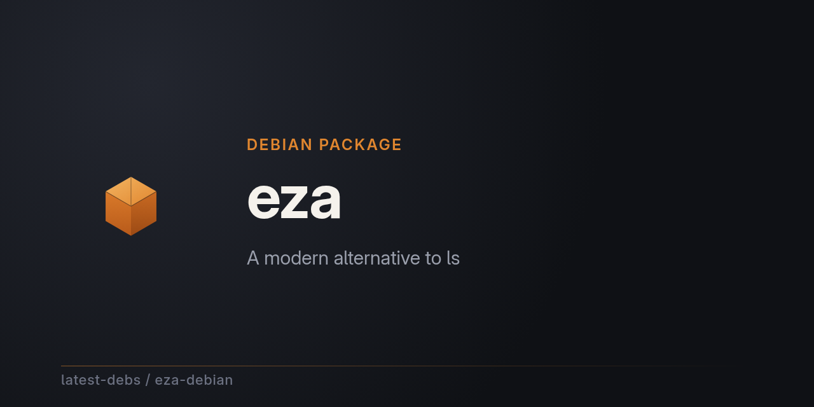

# eza for Debian

[eza](https://github.com/eza-community/eza) — a modern, maintained replacement
for `ls` — packaged for Debian as part of
[latest-debs](https://github.com/latest-debs).

## Install

Via the latest-debs apt repository:

```sh
sudo extrepo enable latest-debs
sudo apt update
sudo apt install eza
```

Or download a `.deb` from the [Releases](https://github.com/latest-debs/eza-debian/releases) page:

```sh
sudo dpkg -i eza_*.deb
```

## Supported distributions & architectures

- Debian Bookworm (12), Trixie (13), Forky (14/testing), Sid (unstable)
- amd64, arm64, armhf

  (eza's upstream releases only publish amd64/arm64/armhf Linux binaries)

## Maintainers wanted

This package doesn't have a dedicated maintainer yet — **we'd love for you
to sign up!** Maintaining just means keeping an eye on new upstream
releases and build breaks; the build itself is automated. Interested? Open
an issue on this repo to volunteer, or say hello in
[org discussions](https://github.com/orgs/latest-debs/discussions) — all
skill levels welcome.

## Disclaimer

Unofficial packaging only. For issues with eza itself, see
[eza-community/eza](https://github.com/eza-community/eza).
